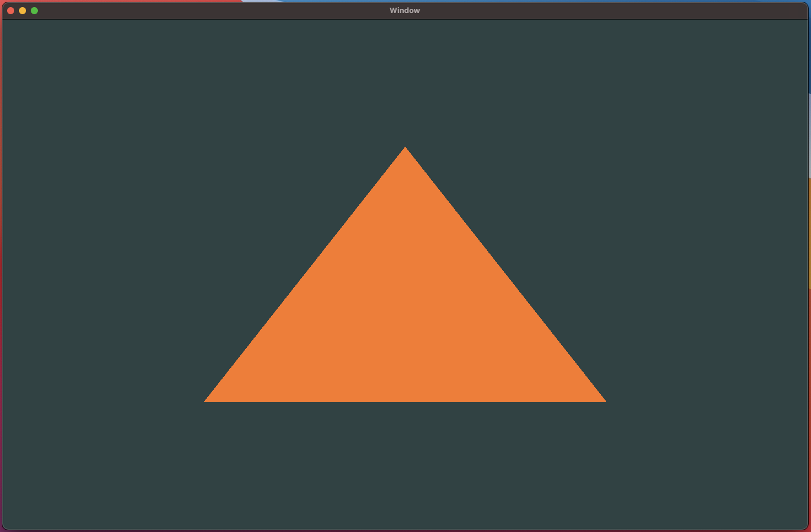

# Hello-Triangle-Metal
The purpose of this app was to learn the basics of Apples Metal graphics API, as I have plans to integrate it into my homebrew engine at a later date.

## What I Learn
- Basic layout of a Metal App
- The basics of MSL (Metal Shading Language)
- The basics of the rendering loop, and the basics of the Metal rendering pipeleine

## Result

